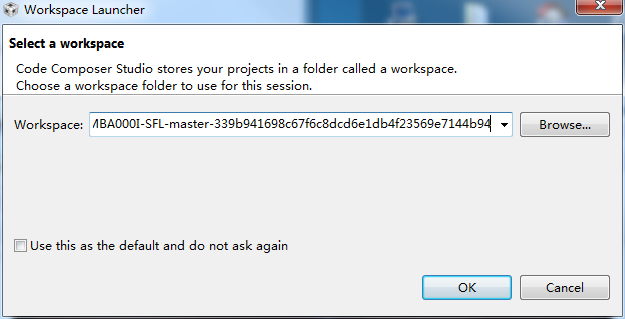
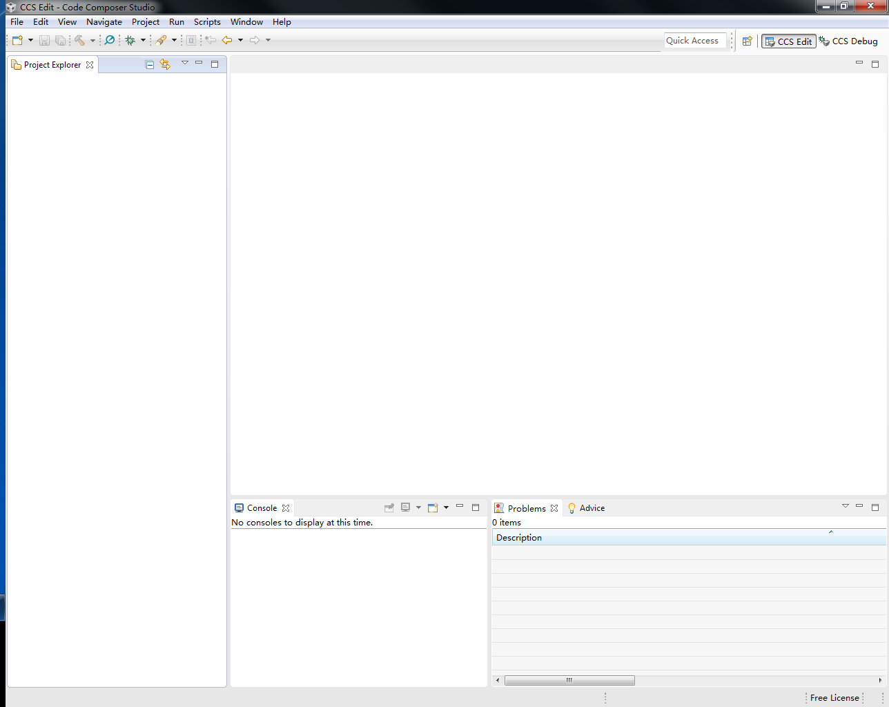
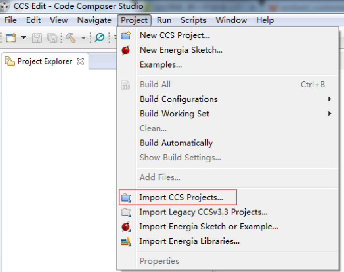
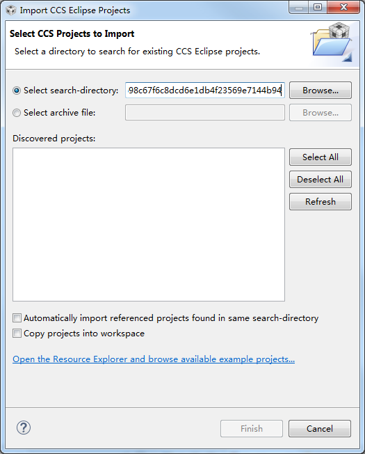
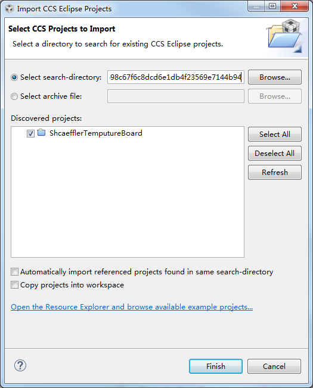
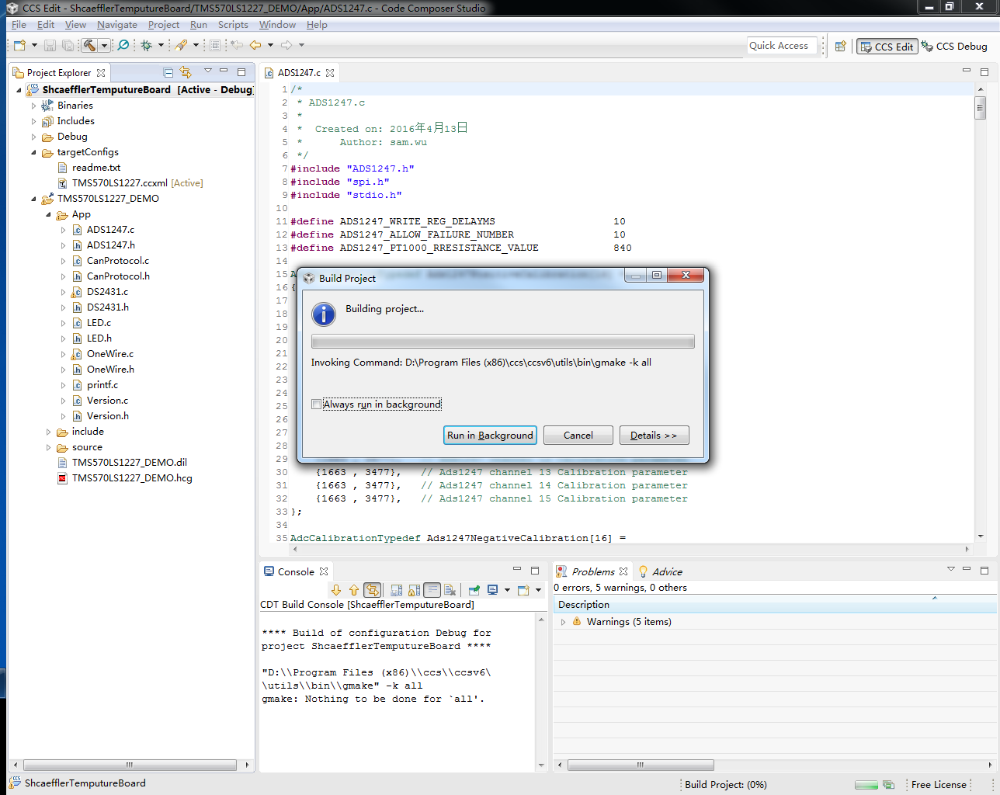

## SBCC-MBA000I-SFL

### Usage

	Step[1]: 
Unzip file:SBCC-MBA000I-SFL-master-339b941698c67f6c8dcd6e1db4f23569e7144b94.zip
	
	Step[2]:
open CCS Software and set current workspace. 

then delate current project from "Project Explorer".
	

	step[3]:
Select "Project->Import CCS Projects..." 

	step[4]:
copy workspace path to "Select search-directory"

press enter, you will see below, then press "Finsh" 

then you can build the project.

	
### Change log
2016-4-26: first commit.